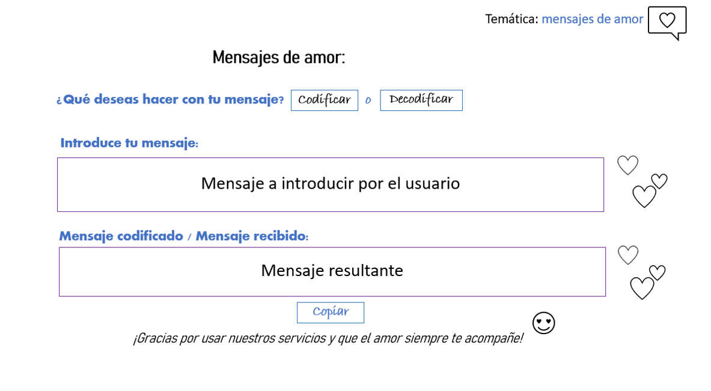
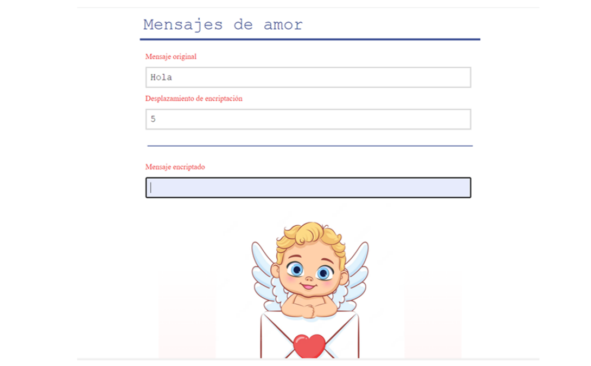
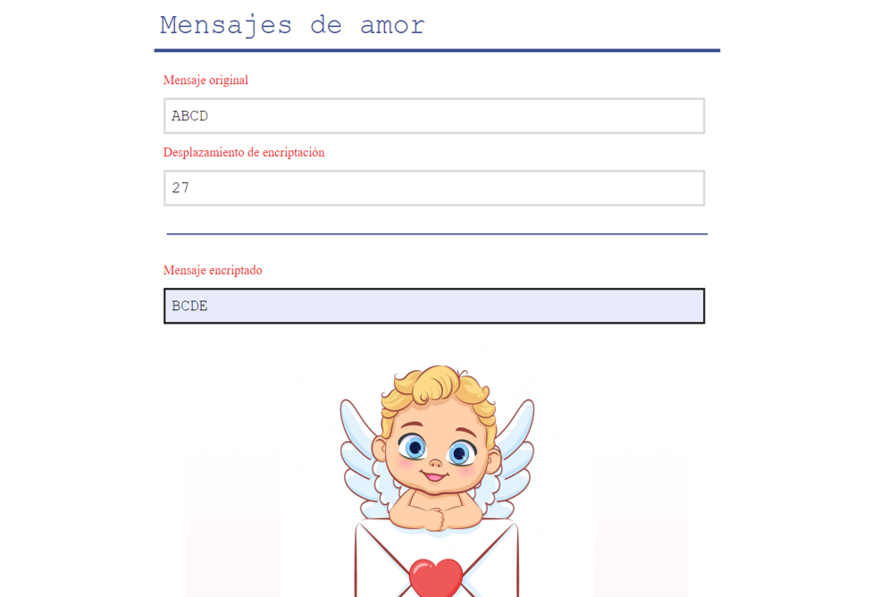
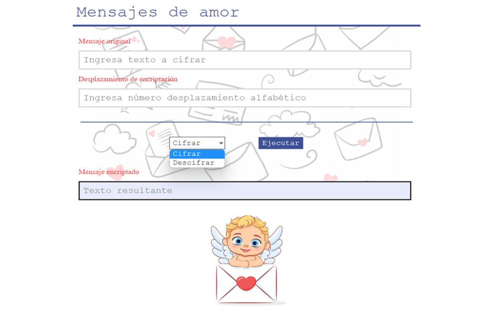
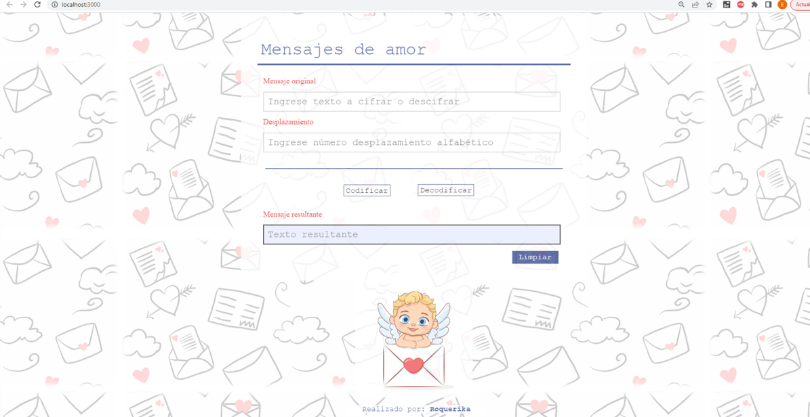
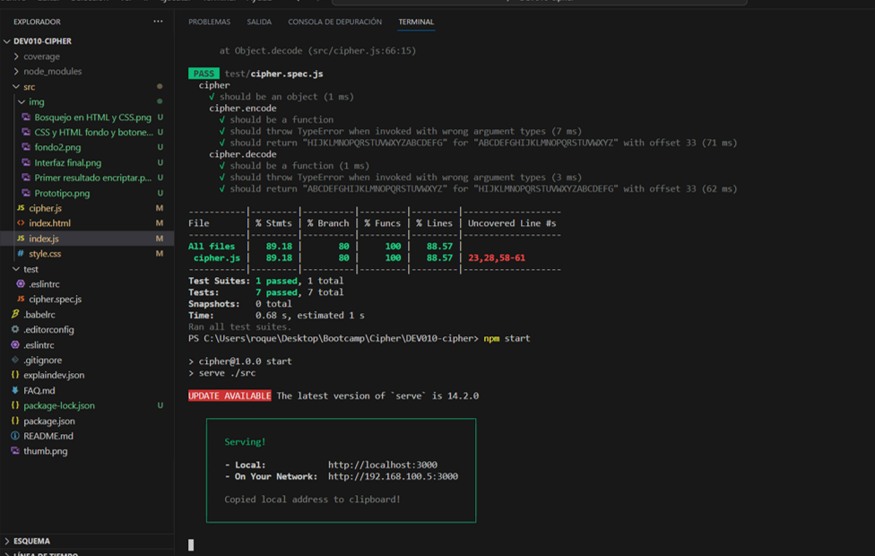

# Cifrado César

## Índice

* [1. Preámbulo](#1-preámbulo)
* [2. Resumen del proyecto](#2-resumen-del-proyecto)
* [3. Consideraciones generales](#3-consideraciones-generales)
* [4. Hito: Criterios de aceptación mínimos del proyecto](#4-hito-criterios-de-aceptación-mínimos-del-proyecto)
* [5. Hito Opcional: Agrega soporte para minúsculas y otros caracteres](#5-hito-opcional-agrega-soporte-para-minúsculas-y-otros-caracteres)
* [6. Consideraciones técnicas](#6-consideraciones-técnicas)
* [7. Objetivos de aprendizaje](#7-objetivos-de-aprendizaje)
* [8. Pistas, tips y lecturas complementarias](#8-pistas-tips-y-lecturas-complementarias)
* [9. Para considerar Project Feedback](#9-para-considerar-project-feedback)

***

## 1. Preámbulo

Cifrar significa ocultar el contenido de un mensaje a simple vista, de manera
que sólo las partes autorizadas pueden descifrar un texto cifrado.
El [cifrado César](https://en.wikipedia.org/wiki/Caesar_cipher)
es uno de los primeros métodos de cifrado conocidos. El emperador romano Julio
César lo usaba para enviar órdenes secretas a sus generales en los campos de
batalla.

El cifrado césar es una de las técnicas más simples para cifrar un mensaje. Es
un tipo de cifrado por sustitución, es decir que cada letra del texto original
es reemplazada por otra que se encuentra un número fijo de posiciones
(desplazamiento) más adelante en el mismo alfabeto.


Por ejemplo, si usamos un desplazamiento (_offset_) de 3 posiciones:

* La letra A se cifra como D.
* La palabra CASA se cifra como FDVD.
* Alfabeto sin cifrar: A B C D E F G H I J K L M N O P Q R S T U V W X Y Z
* Alfabeto cifrado: D E F G H I J K L M N O P Q R S T U V W X Y Z A B C

En la actualidad, todos los cifrados de sustitución simple se descifran con
mucha facilidad y, aunque en la práctica no ofrecen mucha seguridad en la
comunicación por sí mismos; el cifrado César sí puede formar parte de sistemas
más complejos de codificación, como el cifrado Vigenère, e incluso tiene
aplicación en el sistema ROT13.

## 2. Resumen del proyecto

En este proyecto crearás una aplicación web que servirá para que tu usuaria
pueda cifrar y descifrar un texto en el navegador indicando un desplazamiento
específico de caracteres (_offset_). Lo harás utilizando HTML, CSS y JavaScript.

La temática es libre. Piensa en qué situaciones se necesitaría cifrar un mensaje.
Decide cómo debe ser esa experiencia de uso (qué pantallas, explicaciones, mensajes,
colores, etc.) Algunas ideas de ejemplo:  

* Crear claves seguras para el email.
* Encriptar/cifrar una tarjeta de crédito.
* Herramienta de mensajería interna de una organización de derechos humanos en
  una zona de conflicto.
* Mensajería secreta para parejas.

Como continuación del proyecto de preadmisión, volverás a trabajar sobre
fundamentos de JavaScript, incluyendo conceptos como variables, condicionales,
y funciones, así como eventos y manipulación básica del DOM, fundamentos de
HTML y CSS. Mientras desarrollas este proyecto, te familiarizarás con nuevos
conceptos también.

### Los objetivos generales de este proyecto son los siguientes

* Trabajar en base a un boilerplate, la estructura básica de un proyecto en
  distintas carpetas (a través modulos en JS).
* Conocer las herramientas de mantenimiento y mejora del código (linters y
  pruebas unitarias).
* Aprender sobre objetos, estructuras, métodos e iteración (bucles)
  en JavaScript
* Implementar control de versiones con git (y la plataforma github)

## 3. Consideraciones generales

* Este proyecto lo resolvemos de manera **individual**.
* El rango de tiempo estimado para completar el proyecto es de 1 a 3 Sprints.
* Enfócate en aprender y no solamente en "completar" el proyecto.
* Te sugerimos que no intentes saberlo todo antes de empezar a codear.
  No te preocupes demasiado ahora por lo que _todavía_ no entiendas.
  Irás aprendiendo.

## 4. Hito: Criterios de aceptación mínimos del proyecto

Estos son los requisitos que tu proyecto debe que cumplir para asegurar que tu trabajo
cubra los objetivos principales.  

**1. Una interfaz que debe permitir a la usuaria:**

* **Cifrar un mensaje**
  - Insertar el mensaje (texto) que quiere cifrar. El mensaje usa alfabeto
    simplificado (solamente mayúsculas y sin ñ).
  - Elegir un numero de desplazamiento (_offset_) indicando cuántas
    posiciones quieres que el cifrado desplace cada caracter en el alfabeto.
    El numero sera positivo y entero (positive integer).
  - Ver el resultado del mensaje cifrado.

* **Descifrar un mensaje**
  - Insertar el mensaje (texto) que quieres descifrar. El mensaje usa alfabeto
    simplificado (solamente mayúsculas y sin ñ).
  - Elegir un numero desplazamiento (_offset_, que corresponda al que usamos
    para cifrar) indicando cuántas posiciones quieres que
    el cifrado desplace cada caracter en el alfabeto. El numero sera positivo y
    entero (positive integer).
  - Ver el resultado del mensaje descifrado.

**2. Pruebas unitarios de los métodos.**  
Los metódos de `cipher` (`encode` y `decode`) deben tener cobertura con
pruebas unitarias.

**3. Código de tu proyecto subido a tu repo y interfaz "desplegada".**  
El código final debe estar subido en un repositorio en GitHub.  
La interfaz o pagina web, debe ser "desplegada" usando GitHub Pages.

**4. Un README que contiene una definición del producto.**  
En el README cuéntanos cómo pensaste en los usuarios y cuál fue tu proceso
para definir el producto final a nivel de experiencia y de interfaz. Estas
preguntas sirven como guia:

* Quiénes son los principales usuarios de producto
* Cuáles son los objetivos de estos usuarios en relación con tu producto
* Cómo crees que el producto que estás creando está resolviendo sus problemas

Con estos requisitos cumplidos puedes agendar un Project Feedback con unx coach.

## 5. Hito Opcional: Agrega soporte para minúsculas y otros caracteres

Las partes opcionales tienen como intención permitirte profundizar un poco más
sobre los objetivos de aprendizaje del proyecto. Todo en la vida tiene pros y
contras, decide sabiamente si quieres invertir el tiempo en profundizar/
perfeccionar o aprender cosas nuevas en el siguiente proyecto.

El hito de los críterios mínimos no menciona qué pasaría con las letras
minúsculas y otros caracteres (como espacios, puntuación, ñ, ...).
El _boilerplate_ incluye algunos _tests_ (comentados en principio)
que puedes usar como punto de partida para implementar el soporte para
estos casos adicionales.

## 6. Consideraciones técnicas

La lógica del proyecto debe estar implementada completamente en JavaScript. En
este proyecto NO está permitido usar librerías o frameworks, solo JavaScript puro
también conocido como Vanilla JavaScript.

Para comenzar este proyecto tendrás que hacer un _fork_ y _clonar_ este
repositorio que contiene un _boilerplate_ con tests (pruebas). Un _boilerplate_
es la estructura basica de un proyecto que sirve como un punto de partida con
archivos inicial y configuración basica de dependencias y tests.  

Los tests unitarios deben cubrir un mínimo del 70% de _statements_, _functions_
y _lines_, y un mínimo del 50% de _branches_. El _boilerplate_ ya contiene el
setup y configuración necesaria para ejecutar los tests (pruebas) así como _code
coverage_ para ver el nivel de cobertura de los tests usando el comando `npm
test`.

El boilerplate que les damos contiene esta estructura:

```text
./
├── .babelrc
├── .editorconfig
├── .eslintrc
├── .gitignore
├── README.md
├── package.json
├── src
│   ├── cipher.js
│   ├── index.html
│   ├── index.js
│   └── style.css
└── test
    ├── .eslintrc
    └── cipher.spec.js
```

### Descripción de scripts / archivos

* `README.md`: debe explicar la información necesaria para el uso de
  tu aplicación web, así como una introducción a la aplicación,
  su funcionalidad y decisiones de diseño que tomaron.
* `src/index.html`: este es el punto de entrada a tu aplicación. Este archivo
  debe contener tu _markup_ (HTML) e incluir el CSS y JavaScript necesario.
* `src/style.css`: este archivo debe contener las reglas de estilo.
  Queremos que escribas tus propias reglas, por eso NO está permitido el uso
  de frameworks de CSS (Bootstrap, Materialize, etc).
* `src/cipher.js`: acá debes implementar el objeto `cipher`, el cual ya está
  _exportado_ en el _boilerplate_. Este objeto (`cipher`) debe contener dos
  métodos:
  - `cipher.encode(offset, string)`: `offset` es el número de posiciones que
    queremos mover a la derecha en el alfabeto y `string` el mensaje (texto)
    que queremos cifrar.
  - `cipher.decode(offset, string)`: `offset` es el número de posiciones que
    queremos mover a la izquierda en el alfabeto y `string` el mensaje
    (texto) que queremos descifrar.
* `src/index.js`: acá debes escuchar eventos del DOM, invocar `cipher.encode()`
  o `cipher.decode()` según sea necesario y actualizar el resultado en la UI.
* `test/cipher.spec.js`: este archivo contiene algunos tests de ejemplo y acá
  tendrás que implementar los tests para `cipher.encode()` y `cipher.decode()`.

El _boilerplate_ incluye tareas que ejecutan [eslint](https://eslint.org/) y
[htmlhint](https://github.com/yaniswang/HTMLHint) para verificar el `HTML` y
`JavaScript` con respecto a una guías de estilos. Ambas tareas se ejecutan
automáticamente antes de ejecutar las pruebas (tests) cuando usamos el comando
`npm run test`. En el caso de `JavaScript` estamos usando un archivo de
configuración de `eslint` que se llama `.eslintrc` que contiene un mínimo de
información sobre el parser que usar (qué version de JavaScript/ECMAScript), el
entorno (browser en este caso) y las [reglas recomendadas (`"eslint:recommended"`)](https://eslint.org/docs/rules/).
En cuanto a reglas/guías de estilo en sí,
usaremos las recomendaciones _por defecto_ de tanto `eslint` como `htmlhint`.

### Deploy

Hacer que los sitios estén publicados (o _desplegados_) para que usuarias de
la web puedan acceder a él es algo común en proyectos de desarrollo de software.

En este proyecto, utilizaremos _Github Pages_ para desplegar nuestro sitio web.

El comando `npm run deploy` puede ayudarte con esta tarea y también puedes
 consultar su [documentación oficial](https://docs.github.com/es/pages).

***

## 7. Objetivos de aprendizaje

Reflexiona y luego marca los objetivos que has llegado a entender y aplicar en tu proyecto. Piensa en eso al decidir tu estrategia de trabajo.

### HTML

- [ ] **Uso de HTML semántico**

  <details><summary>Links</summary><p>

  * [HTML semántico](https://curriculum.laboratoria.la/es/topics/html/02-html5/02-semantic-html)
  * [Semantics - MDN Web Docs Glossary](https://developer.mozilla.org/en-US/docs/Glossary/Semantics#Semantics_in_HTML)
</p></details>

### CSS

- [ ] **Uso de selectores de CSS**

  <details><summary>Links</summary><p>

  * [Intro a CSS](https://curriculum.laboratoria.la/es/topics/css/01-css/01-intro-css)
  * [CSS Selectors - MDN](https://developer.mozilla.org/es/docs/Web/CSS/CSS_Selectors)
</p></details>

- [ ] **Modelo de caja (box model): borde, margen, padding**

  <details><summary>Links</summary><p>

  * [Box Model & Display](https://curriculum.laboratoria.la/es/topics/css/01-css/02-boxmodel-and-display)
  * [The box model - MDN](https://developer.mozilla.org/en-US/docs/Learn/CSS/Building_blocks/The_box_model)
  * [Introduction to the CSS box model - MDN](https://developer.mozilla.org/en-US/docs/Web/CSS/CSS_Box_Model/Introduction_to_the_CSS_box_model)
  * [CSS display - MDN](https://developer.mozilla.org/pt-BR/docs/Web/CSS/display)
  * [display - CSS Tricks](https://css-tricks.com/almanac/properties/d/display/)
</p></details>

### Web APIs

- [ ] **Uso de selectores del DOM**

  <details><summary>Links</summary><p>

  * [Manipulación del DOM](https://curriculum.laboratoria.la/es/topics/browser/02-dom/03-1-dom-methods-selection)
  * [Introducción al DOM - MDN](https://developer.mozilla.org/es/docs/Web/API/Document_Object_Model/Introduction)
  * [Localizando elementos DOM usando selectores - MDN](https://developer.mozilla.org/es/docs/Web/API/Document_object_model/Locating_DOM_elements_using_selectors)
</p></details>

- [ ] **Manejo de eventos del DOM (listeners, propagación, delegación)**

  <details><summary>Links</summary><p>

  * [Introducción a eventos - MDN](https://developer.mozilla.org/es/docs/Learn/JavaScript/Building_blocks/Events)
  * [EventTarget.addEventListener() - MDN](https://developer.mozilla.org/es/docs/Web/API/EventTarget/addEventListener)
  * [EventTarget.removeEventListener() - MDN](https://developer.mozilla.org/es/docs/Web/API/EventTarget/removeEventListener)
  * [El objeto Event](https://developer.mozilla.org/es/docs/Web/API/Event)
</p></details>

- [ ] **Manipulación dinámica del DOM**

  <details><summary>Links</summary><p>

  * [Introducción al DOM](https://developer.mozilla.org/es/docs/Web/API/Document_Object_Model/Introduction)
  * [Node.appendChild() - MDN](https://developer.mozilla.org/es/docs/Web/API/Node/appendChild)
  * [Document.createElement() - MDN](https://developer.mozilla.org/es/docs/Web/API/Document/createElement)
  * [Document.createTextNode()](https://developer.mozilla.org/es/docs/Web/API/Document/createTextNode)
  * [Element.innerHTML - MDN](https://developer.mozilla.org/es/docs/Web/API/Element/innerHTML)
  * [Node.textContent - MDN](https://developer.mozilla.org/es/docs/Web/API/Node/textContent)
</p></details>

### JavaScript

- [ ] **Tipos de datos primitivos**

  <details><summary>Links</summary><p>

  * [Valores primitivos - MDN](https://developer.mozilla.org/es/docs/Web/JavaScript/Data_structures#valores_primitivos)
</p></details>

- [ ] **Strings (cadenas de caracteres)**

  <details><summary>Links</summary><p>

  * [Strings](https://curriculum.laboratoria.la/es/topics/javascript/06-strings)
  * [String — Cadena de caracteres - MDN](https://developer.mozilla.org/es/docs/Web/JavaScript/Reference/Global_Objects/String)
</p></details>

- [ ] **Variables (declaración, asignación, ámbito)**

  <details><summary>Links</summary><p>

  * [Valores, tipos de datos y operadores](https://curriculum.laboratoria.la/es/topics/javascript/01-basics/01-values-variables-and-types)
  * [Variables](https://curriculum.laboratoria.la/es/topics/javascript/01-basics/02-variables)
</p></details>

- [ ] **Uso de condicionales (if-else, switch, operador ternario, lógica booleana)**

  <details><summary>Links</summary><p>

  * [Estructuras condicionales y repetitivas](https://curriculum.laboratoria.la/es/topics/javascript/02-flow-control/01-conditionals-and-loops)
  * [Tomando decisiones en tu código — condicionales - MDN](https://developer.mozilla.org/es/docs/Learn/JavaScript/Building_blocks/conditionals)
</p></details>

- [ ] **Uso de bucles/ciclos (while, for, for..of)**

  <details><summary>Links</summary><p>

  * [Bucles (Loops)](https://curriculum.laboratoria.la/es/topics/javascript/02-flow-control/02-loops)
  * [Bucles e iteración - MDN](https://developer.mozilla.org/es/docs/Web/JavaScript/Guide/Loops_and_iteration)
</p></details>

- [ ] **Funciones (params, args, return)**

  <details><summary>Links</summary><p>

  * [Funciones (control de flujo)](https://curriculum.laboratoria.la/es/topics/javascript/02-flow-control/03-functions)
  * [Funciones clásicas](https://curriculum.laboratoria.la/es/topics/javascript/03-functions/01-classic)
  * [Arrow Functions](https://curriculum.laboratoria.la/es/topics/javascript/03-functions/02-arrow)
  * [Funciones — bloques de código reutilizables - MDN](https://developer.mozilla.org/es/docs/Learn/JavaScript/Building_blocks/Functions)
</p></details>

- [ ] **Pruebas unitarias (unit tests)**

  <details><summary>Links</summary><p>

  * [Empezando con Jest - Documentación oficial](https://jestjs.io/docs/es-ES/getting-started)
</p></details>

- [ ] **Módulos de ECMAScript (ES Modules)**

  <details><summary>Links</summary><p>

  * [import - MDN](https://developer.mozilla.org/es/docs/Web/JavaScript/Reference/Statements/import)
  * [export - MDN](https://developer.mozilla.org/es/docs/Web/JavaScript/Reference/Statements/export)
</p></details>

- [ ] **Uso de linter (ESLINT)**

- [ ] **Uso de identificadores descriptivos (Nomenclatura y Semántica)**

### Control de Versiones (Git y GitHub)

- [ ] **Git: Instalación y configuración**

- [ ] **Git: Control de versiones con git (init, clone, add, commit, status, push, pull, remote)**

- [ ] **GitHub: Creación de cuenta y repos, configuración de llaves SSH**

- [ ] **GitHub: Despliegue con GitHub Pages**

  <details><summary>Links</summary><p>

  * [Sitio oficial de GitHub Pages](https://pages.github.com/)
</p></details>

### Centrado en el usuario

- [ ] **Diseñar y desarrollar un producto o servicio poniendo a las usuarias en el centro**

### Diseño de producto

- [ ] **Crear prototipos de alta fidelidad que incluyan interacciones**

- [ ] **Seguir los principios básicos de diseño visual**

## 8. Pistas, tips y lecturas complementarias

### Prepara tu PC para trabajar

Antes de comenzar instala lo siguiente:

1. [Node.js](https://nodejs.org/)
2. [git](https://git-scm.com/download/) Si estas en Linux es muy probable que
  ya este instalado 👀.
  Para conocer más de git visita
  [este enlace](https://curriculum.laboratoria.la/es/topics/scm/01-git)
3. Un editor de código, te sugerimos [Code](https://code.visualstudio.com/)

Después en [GitHub](https://github.com/):

1. Crear una cuenta. Conoce más de GitHub en este
  [link](https://curriculum.laboratoria.la/es/topics/scm/02-github/01-github)
2. Realiza un fork de este proyecto
3. Configura tu SSH Key  en GitHub. Puedes revisar este
[video](https://www.youtube.com/watch?v=g0ZV-neSM7E) o
[artículo](https://docs.github.com/es/authentication/connecting-to-github-with-ssh/generating-a-new-ssh-key-and-adding-it-to-the-ssh-agent)

Luego en una [shell](https://curriculum.laboratoria.la/es/topics/shell)
ejecuta lo siguiente. Si estas en Windows puedes usar Git Bash:

1. Clona el fork en tu PC
2. Ubica la shell en el proyecto que clonaste
3. Instala las dependencias del proyecto con `npm install`
4. Para arrancar el servidor web `npm start` y dirígete a
   `http://localhost:3000` en tu navegador.
5. A codear se ha dicho! :rocket:

### Recursos y temas relacionados

Súmate al canal de Slack
[#project-cipher](https://claseslaboratoria.slack.com/archives/C03LJSH6R7D)
para conversar y pedir ayuda del proyecto.

A continuación un video que te lleva a través de la fórmula matemática del
Cifrado César y un par de cosas más que debes saber para resolver este proyecto.
La fórmula no es lo importante del proyecto, no te confundas.

[](https://youtu.be/uehgMrP6few)

Terminal y shell de UNIX:

[](https://www.youtube.com/playlist?list=PLiAEe0-R7u8nGH5TEHfSTeDNIvjZFe_Yd)

[Link](https://www.youtube.com/playlist?list=PLiAEe0-R7u8nGH5TEHfSTeDNIvjZFe_Yd)

Control de versiones y trabajo colaborativo con Git y GitHub:

[](https://www.youtube.com/playlist?list=PLiAEe0-R7u8k9o3PbT3_QdyoBW_RX8rnV)

[Link](https://www.youtube.com/playlist?list=PLiAEe0-R7u8nGH5TEHfSTeDNIvjZFe_Yd)

Desarrollo Front-end:

* [Aprende más sobre `charCodeAt()`](https://developer.mozilla.org/es/docs/Web/JavaScript/Referencia/Objetos_globales/String/charCodeAt)
* [Aprende más sobre `String.fromCharCode()`](https://developer.mozilla.org/es/docs/Web/JavaScript/Referencia/Objetos_globales/String/fromCharCode)
* [Aprende más sobre `ASCII`](http://conceptodefinicion.de/ascii/)
* Aprende más sobre [objetos](https://es.javascript.info/object) y
  [como definir métodos](https://developer.mozilla.org/es/docs/Web/JavaScript/Guide/Working_with_Objects#definici%C3%B3n_de_m%C3%A9todos)

Organización del Trabajo:

* [Metodologías Ágiles](https://www.youtube.com/watch?v=v3fLx7VHxGM)
* [Scrum en menos de 2 minutos](https://www.youtube.com/watch?v=TRcReyRYIMg)
* [Scrum en Detalle](https://www.youtube.com/watch?v=nOlwF3HRrAY&t=297s). No
  esperamos que hagas todo eso desde este proyecto. Iremos profundizando poco a
  poco a lo largo del -_bootcamp_.

***

## 9. Para considerar Project Feedback

En resumen, los criterios de aceptación mínimos del proyecto para considerar
Project Feedback:

* [ ] Tiene una interfaz que permite a la usuaria cifrar y descifrar.
* [ ] El proyecto será entregado incluyendo pruebas unitarios de los métodos de `cipher`
(`encode` y `decode`).
* [ ] El proyecto será entregado libre de _errores_ de `eslint` (_warnings_ son ok).
* [ ] El proyecto será entregado subiendo tu código a GitHub.
* [ ] La interfaz será "desplegada" usando GitHub Pages.
* [ ] El README contiene una definición del producto.

## 10. Definición del producto:

   Teniendo en cuenta que los cifrados, códigos y claves son parte esencial en nuestras vidas, abordé este proyecto para conocer sobre el funcionamiento de un cifrado básico como el cifrado caesar que puede dar lugar a cifrados más complejos.
   
   Una vez elegido el proyecto y en función de las opciones de diseño, elegí el enfoque del producto “Mensajes de amor” ya que el amor es una de las emociones más importantes que nos permite vincularnos a las personas, por tanto incitar a la picardía y entusiasmo de cifrar mensajes especiales para un ser querido cuyo significado solo puede ser conocido entre los participantes de dicho mensaje y potenciar las sensaciones de agrado, bienestar y satisfacción en la comunidad que interacciona con esta herramienta, han sido el motivo para desarrollar el diseño y la funcionalidad del producto.

* Usuarios: 
   La interfaz está pensada principalmente para personas que mantienen un vínculo amoroso del [ciclo de la intimidad afectiva] [https://www.todoparaellas.com/sexualidad/2021/4/8/vinculos-amorosos-que-son-cuales-son-las-caracteristicas-de-cada-uno-de-ellos-7592.html] con la pareja, con la familia o con los amigos.

* Objetivo del usuario en relación con tu producto:
   Codificar / decodificar un mensaje cuyo contenido tiene categoría de secreto o confidencial para los participantes en el proceso de comunicación (emisor-receptor).
   
* Respuesta del producto al problema:
   La forma en que el producto resuelve el problema es simple, ya que permite asignar un número de desplazamiento elegido por el usuario que incide en  el alfabeto conocido, desplazando cada carácter del mensaje tantas veces como el usuario lo haya indicado, permitiendo generar un mensaje resultante de composición ilegible de acuerdo a las nuevas letras que conforman el mensaje respecto al alfabeto tradicional, de esta misma manera se puede obtener la revelación de un mensaje previamente codificado conociendo el valor de desplazamiento asignado.

* Duración del proyecto y conocimientos previos:
   El proyecto tuvo una duración de tres-Sprints de cinco días de seis a ocho horas, partiendo de un conocimiento de básico a nulo respecto a las herramientas necesarias para llevarlo a cabo, las cuales fueron: HTML, CSS, JS, Git, Node.js y Visual estudio code.
   
* Definición del producto final a nivel de experiencia y de interfaz:

   Inicialmente se realizó un prototipo de la interfaz en función de los requerimientos a cumplir:
   
   La temática, indicarle al usuario que escogiera entre codificar y decodificar, un espacio para introducir el mensaje original y un espacio para obtener el mensaje codificado/descodificado, también un botón para copiar el mensaje obtenido, se asume que el desplazamiento es fijo para la interfaz y no es una opción variable para el usuario.
   
   
   
   Posteriormente se realizó una representación inicial del prototipo en HTML y CSS, en este punto se consideró incluir un input tipo número para que el usuario eligiera el valor de desplazamiento del alfabeto tradicional ya que así estaba estipulado en el Readme preestablecido, sin embargo la codificación en JS era escueta por tanto aún no se podía encriptar un mensaje y los caracteres ingresados podían ser mayúsculas, minúsculas, números, símbolos y espacios.
   

   A través de JS se logró realizar la codificación tal que independientemente del valor ingresado por el usuario el desplazamiento ocurriera en función de los caracteres en mayúscula ASCII, en este punto solo se podía codificar un mensaje, aún no se lograba decodificar, de igual manera se estuvo trabajando en un solo archivo JS por desconocimiento sobre trabajar con módulos y la interacción entre estos.

   También se logró delimitar el input de mensaje original para admitir solamente caracteres en mayúsculas, en este punto los caracteres ingresados independientemente que fuese letras minúsculas se observan en el input en mayúsculas, la limitación encontrada era que no se podía ingresar espacios ni caracteres especiales, para esto se trabajó con una función regular de JS que se encontró en la web sin entender muy bien su funcionamiento, salvo por los resultados reflejados en la interfaz.
   

   Debido a que la interfaz se percibía muy simple, se incorporó un fondo alusivo a la temática “Mensajes de amor”, sin embargo resulto difícil otorgar opacidad al back-ground en CSS por tanto se editó la imagen en ppt y se subió a VSC desde el ordenador, se generó y se otorgó estilos a un select para elegir entre cifrar y descifrar y un botón para ejecutar la función seleccionada por el usuario, en este punto los botones no tenían funcionalidad y en el feedback de la demo se obtuvo la observación de aclarar aún más el fondo o ampliarlo para que ocupara toda la interfaz pero en el main presentara un tonalidad más clara.
   

   Ahora bien, se editó nuevamente el fondo en ppt y se cargó la imagen a VSC desde el ordenador, se modificó la propiedad opacidad en el main, así como también la imagen principal denominada cupido.

   Se logró generar el código JS para decodificar un mensaje previamente codificado con un desplazamiento conocido por el usuario, se añadió un botón limpiar con funcionalidad en JS, se cambió el selector y el botón ejecutar por dos botones enlazadas a las funciones codificar y decodificar.

   La limitación encontrada era que el mensaje se cifraba en tiempo real, por tanto se debía modificar la función a manera de que esta dependiera del clic en el botón seleccionado y así resolver la decodificación en función del desplazamiento seleccionado, pues como partí del código para codificar, solo codificaba y comentando la expresión regular de la función codificar logré incorporar los espacios pero eran de codificación también.

   Asistí a una sesión corta de ayuda con un coach para conversar sobre la ubicación de la función de los botones en JS, el mantener los espacios del input de mensaje original en el mensaje resultante y hacer stop si se quiere a la función codificar para que no se ejecutara en tiempo real, la verdad no entendí mucho y el tiempo fue muy corto pero me sirvió de guía para buscar y lograra solucionar parcialmente el problema, indico parcialmente ya que si bien se pueden ingresar los espacios y se pueden obtener de la misma forma en el mensaje resultante, no tengo soporte para números, caracteres espaciales y la Ñ, antes estaba limitado la incorpación de estos en el input original y no se podían escribir, ahora se pueden incorporar al input de mensaje original obteniendo la codificación de estos en función del desplazamiento indicado por el usuario y al intentar descifrarlos no se generan los caracteres original, por tanto el soporte de la interfaz está dirigida solo para caracteres alfabéticos en minúscula y en mayúscula debido al uso de UpperCase en JS.

   También se agregó un footer como extra de acuerdo con lo observado en las demos de mis compañeras y para otorgarle personalidad.
   El desafío más grande fue trabajar con módulos, debido a que no comencé de tal manera y las funciones desarrolladas fluían en un solo módulo JS, una vez desbloqueado este conflicto la interfaz quedó funcional.

   

* Aplicación de tests unitarios:
   Este punto también representó un gran desafío y una enseñanza importante: “Seguir al pie de la letra el Readme preestablecido y realizar el test a medida que se desarrolla el código para entender los requerimientos específicos del proyecto”.

   Inicialmente desconocía como aplicar el test, para ello solicité ayuda a varias compañeras por slack, finalmente logré canalizar la información recibida e implementar los test requeridos, me funcionó para indentar el código, también para no prestar atención a las alertas generadas en consola de acuerdo a lo informado por una compañera que ya había realizado los test.
   
   El principal problema ocurrió al no aprobar ningún test de 7, entendí que la forma creado el objeto en el módulo cipher.js era incorrecta al igual que la forma de importarlo en el módulo index.js, por tanto lo corregí y aprobé ese test, posteriormente me encontré con la dificultad de que al probar con un mensaje original y un desplazamiento random la función codificar no devolvía lo esperado de esa forma noté que tenía que modificar los argumentos de la función, en este caso invertirlos para coincidir con las especificaciones del test, pero me encontré como otra limitante la función bucle for estaba establecida en el módulo index.js, por tanto al ingresar “ABCDEFGHIJKLMNOPQRSTUVWXYZ” con un desplazamiento de 33 solo se obtenía la letra “H”, empleando console.log, se encontró que el texto completo se obtenía  a partir de index.
   js, se intentó solucionar con múltiples modificaciones, al igual que se consultó por slack y se trabajó en función de una sugerencia de un coach, sin embargo no logré resolverlo.

   Finalmente con chat GPT se logró incorporar un bucle for que permitiera obtener la codificación completa a partir de la función codificar en cipher.js, se realizaron los cambios pertinentes en la función decodificar y ahora se aprobaban 5 de 7 test.

   El último error estaba asociado a la limitación de los argumentos de las funciones codificar/decodificar, respecto a aceptar solo números y texto, antes de agregar el for al objeto cipher daba ok, pero después no, no supe porque ni supe resolverlo, para esto revisé algunos repositorios de mis compañeras en encontré una función if explicada que empleé en mis funciones codificar/decodificar del objeto cipher y así dar respuesta al requerimiento del test.

   Intenté quitar el for de index.js y no logré funcionalidad en la interfaz ni como asociar el objeto cipher a index.js de una manera distinta ala que tenía establecida, por tanto la versión final aunque funcional contiene este erro que no pude solucionar, pero que dan respuesta tanto a los requerimientos del test como a la funcionalidad de la interfaz. 

   

      *Las Webs consultadas han sido las siguientes:*

* [rot-13](https://parzibyte.me/blog/2019/05/24/rot-13-java-algoritmo-variantes-rot-1/)
* [Eventos en JS](https://developer.mozilla.org/es/docs/Learn/JavaScript/Building_blocks/Events)
* [falso y falso es falso en JS](https://stackoverflow.com/questions/44206185/javascript-false-false-is-false)
* [Expresiones regulares en JS](https://developer.mozilla.org/es/docs/Web/JavaScript/Guide/Regular_expressions)
* [String en JS](https://developer.mozilla.org/es/docs/Web/JavaScript/Reference/Global_Objects/String)
* [iniciando Jest](https://jestjs.io/es-ES/docs/getting-started)
* [Instalación de Jest](https://www.youtube.com/watch?v=VpYSV2D-9NM)
* [Indentar el código en VSC](https://programaraciegas.net/?p=992#:~:text=En%20el%20caso%20de%20Windows,es%20Control%2BMay%C3%BAsculas%2BI)
* [Chat GPT] (https://chat.openai.com)
* [rix] (https://hashnode.com/rix)
* [Etiqueta background position en CSS](https://uniwebsidad.com/libros/referencia-css2/background-position)
* [Etiqueta background position en CSS](https://developer.mozilla.org/es/docs/Web/CSS/background-position)  
* [addEventListener](https://developer.mozilla.org/en-US/docs/Web/API/EventTarget/addEventListener)
* [Modelo básico de eventos](https://docplayer.es/15175824-Eventos-ii-modelo-basico-de-eventos.html)
* [JS] (https://www.todo-argentina.net/cursos/javascript/pagina56.php)
* [Objetos y eventos en JS](https://www.aprenderaprogramar.com/index.php?option=com_content&view=article&id=843:objeto-event-javascript-type-target-currenttarg-timestamp-clientx-pagex-button-preventdefault-cu01160e&catid=78&Itemid=206)
* [Tutorial formularios HTML] (https://www.htmlquick.com/es/tutorials/forms/2.html)
* [Selectores CSS par input](https://desarrolloweb.com/faq/que-selector-css-usar-para-seleccionar-un-campo-input-que-tiene-el-atributo-namesearch)
* [atributo height en CSS] (https://developer.mozilla.org/es/docs/Web/CSS/height)
* [Cómo encriptar y desencriptar usando JS](https://www.youtube.com/watch?v=6uuSceftOe4)
* [Convertidor cifrado césar usando HTML, CCS y JS](https://www.youtube.com/watch?v=hlh1kHlOqYs)
* [Codificando en JS](https://www.youtube.com/watch?v=yTt1ZT9KKHc)
* [función para cifrado césar en JS](https://donnierock.com/2023/04/13/funcion-de-javascript-para-emular-el-cifrado-cesar/)
* [Cifrado césar JS](https://www.lawebdelprogramador.com/codigo/JavaScript/3270-Cifrado-Cesar.html#google_vignette)
* [Cifrado césar HTML, CSS y JS](https://codepen.io/jersonramirezortiz/pen/OJJGLXy)
* [Reto resuelto de programación cifrado césar](https://www.youtube.com/watch?v=67z0sZX9iok)
* [Cómo usar break y continue en JS](https://www.digitalocean.com/community/tutorials/how-to-use-break-continue-and-pass-statements-when-working-with-loops-in-python-3-es)
* [Uso de getElementByClassName en JS](https://developer.mozilla.org/es/docs/Web/API/Document/getElementsByClassName)
* [Complemento para botón limpiar](https://es.stackoverflow.com/questions/49635/como-limpiar-un-campo-concreto-en-javascript)
* [Edición de botones con CSS](https://www.w3bai.com/es/css/css3_buttons.html#gsc.tab=0)
* [Condicionales JS](https://developer.mozilla.org/es/docs/Learn/JavaScript/Building_blocks/conditionals)
* [Cifrado césar | Tutotial Javascript](https://www.youtube.com/watch?v=7A4pdwpT10Q)
* [Cifrado césar encriptado y desencriptado Web App con JS | criptografía en JS](https://www.youtube.com/watch?v=CNDijVw-tSQ)
* [Curso de Js desde cero (completo)- Nivel Junior soy Dalto](https://www.youtube.com/watch?v=z95mZVUcJ-E&t=33895s)